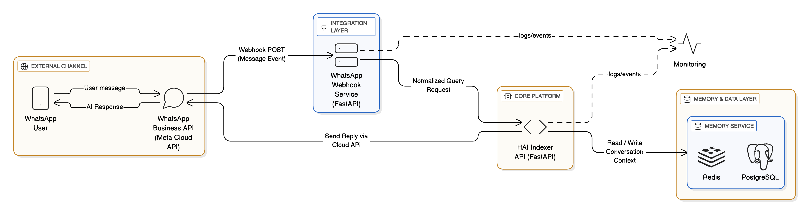
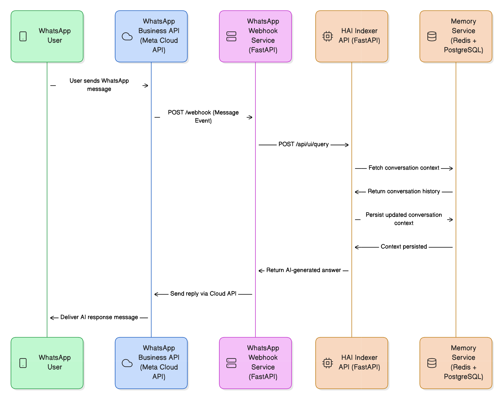

# WhatsApp Service

A service component for the HAI-INDEXER system that handles WhatsApp integration and messaging functionality.

## Documentation

This repository contains architectural documentation and diagrams for the WhatsApp service integration.

---

## Architecture Diagrams

### Integration Architecture Diagram

> Shows the overall system architecture and how the WhatsApp service integrates with other components.

---

### Sequence Diagram

> Illustrates the message flow and interaction sequences within the WhatsApp service.

---

## Status

This project is currently in the planning/design phase.  
Comprehensive documentation and implementation will be added in future updates.

## Getting Started

_Coming soon – detailed setup and installation instructions will be provided once implementation begins._

## Contributing

_Coming soon – contribution guidelines will be added as the project develops._
